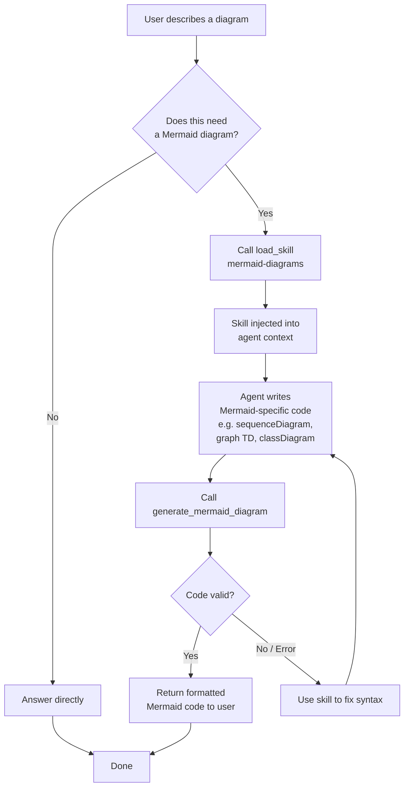
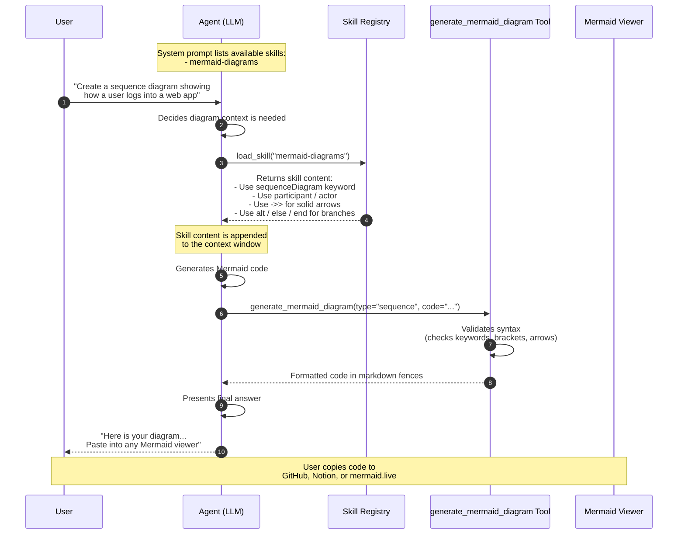

# Agentic Mermaid Diagram Generator

A proof-of-concept demonstrating an agentic pattern where an LLM agent uses on-demand skills to generate correct Mermaid diagram code. The agent loads a Mermaid skill before writing any diagram syntax, ensuring valid output for flowcharts, sequence diagrams, class diagrams, state diagrams, and more.

---

## Architecture

### System Flowchart



### Request Flow (Sequence Diagram)



---

## Prerequisites

- **Python** 3.10+
- **Ollama** (for local LLM inference)
- A model capable of tool use (tested with `ministral-3:latest`)

---

## Setup

### 1. Install Python Dependencies

```bash
pip install -r requirements.txt
```

### 2. Configure Ollama

Pull the model (tested with `ministral-3:latest`):

```bash
ollama pull ministral-3:latest
```

Ensure Ollama is running:

```bash
ollama serve
```

### 3. Configure Environment

Create a `.env` file:

```bash
# Ollama / LiteLLM configuration
LITELLM_API_KEY=ollama
LITELLM_API_BASE=http://localhost:11434/v1
```

> **Note:** When using Ollama, the API key can be any string (e.g., `ollama`). The base URL points to Ollama's OpenAI-compatible endpoint.

---

## File Structure

```
.
├── .env                      # Environment variables
├── skills.py                 # Mermaid skill definitions
├── mermaid_tool.py           # Validation and formatting tool
├── agent.py                  # Agent wiring and middleware
└── requirements.txt          # Python dependencies
```

---

## Running the Agent

```bash
python agent.py
```

The agent will:
1. Receive your diagram description
2. Load the `mermaid-diagrams` skill on demand
3. Generate correct Mermaid syntax for the requested diagram type
4. Validate the code (check brackets, keywords, arrow types)
5. Return formatted code ready for any Mermaid viewer

---

## Example Trace

Below is a real trace using **Ollama** with **`ministral-3:latest`**:

**User:**
> Create a sequence diagram showing how a user logs into a web app. Include the browser, frontend server, auth service, and database. Show success and failure paths.

**Agent (Turn 1 - Load Skill):**
> Tool Calls:
> - `load_skill(skill_name="mermaid-diagrams")`

**Tool Result:**
> Loaded skill: mermaid-diagrams
>
> # Mermaid Diagrams Skill
> ## Sequence Diagrams
> - Start with: `sequenceDiagram`
> - Participants: `participant A as Alice`
> - Arrows: `A->>B: Message`
> - Blocks: `alt ... else ... end`
> ...

**Agent (Turn 2 - Generate Diagram):**
> Tool Calls:
> - `generate_mermaid_diagram(diagram_type="sequence", mermaid_code="sequenceDiagram\n    participant U as User\n    ...")`

**Tool Result:**
> ```mermaid
> sequenceDiagram
>     participant U as User
>     participant B as Browser
>     participant F as Frontend
>     participant A as AuthService
>     participant D as Database
>
>     U->>B: Enter credentials
>     B->>F: POST /login
>     F->>A: Validate credentials
>     A->>D: Query user hash
>
>     alt Valid credentials
>         D-->>A: Return user record
>         A-->>F: Issue JWT token
>         F-->>B: Set cookie + redirect
>         B-->>U: Show dashboard
>     else Invalid credentials
>         D-->>A: User not found
>         A-->>F: 401 Unauthorized
>         F-->>B: Show error
>         B-->>U: "Invalid login"
>     end
> ```

**Agent (Final Answer):**
> Here is your sequence diagram:
>
> ```mermaid
> sequenceDiagram
>     ...
> ```
>
> You can paste this into any Mermaid viewer (e.g., GitHub markdown, Notion, or mermaid.live) to see the visualization.

---

## How It Works

### Progressive Skill Disclosure

The agent uses a three-layer context strategy:

| Layer | Content | When It Appears |
|-------|---------|-----------------|
| **Layer 1** | System prompt + skill descriptions | Every request |
| **Layer 2** | Full skill content (Mermaid syntax rules) | Only after `load_skill` is called |
| **Layer 3** | Conversation history (questions, tool calls, results) | Grows with each turn |

This keeps the context window small for non-diagram questions while ensuring the agent has detailed syntax rules when it needs them.

### Validation Layer

The `generate_mermaid_diagram` tool acts as a safety net:

- Checks the diagram starts with the correct keyword (`sequenceDiagram`, `graph TD`, etc.)
- Detects unbalanced brackets and parentheses
- Flags arrow syntax mismatches (e.g., using `->>` in a flowchart)
- Returns formatted markdown fences ready for rendering

### Supported Diagram Types

| Type | Keyword | Use Case |
|------|---------|----------|
| Flowchart | `graph TD` / `graph LR` | Processes, decision trees |
| Sequence | `sequenceDiagram` | API calls, user interactions |
| Class | `classDiagram` | Object-oriented design |
| State | `stateDiagram-v2` | State machines |
| Gantt | `gantt` | Project timelines |
| ER | `erDiagram` | Database relationships |
| Pie | `pie` | Data distribution |
| Mindmap | `mindmap` | Hierarchical ideas |

---

## Customization

### Adding More Diagram Types

Edit `skills_mermaid.py` and extend the skill `content` with new sections:

```markdown
## Gantt Charts

- Start with: `gantt`
- Date format: `dateFormat YYYY-MM-DD`
- Sections: `section Development`
- Tasks: `Task name :done, id, 2026-01-01, 2026-01-15`
```

The `SkillMiddleware` will automatically make it available without code changes.

### Switching LLM Models

Update the model name in `mermaid_agent.py`:

```python
llm = ChatOpenAI(
    openai_api_base=os.getenv("LITELLM_API_BASE"),
    api_key=os.getenv("LITELLM_API_KEY"),
    model="ministral-3:latest",  # or any Ollama / OpenAI model
    temperature=0.2,
)
```

---

## Notes

- **Ollama Compatibility:** This POC was tested successfully with `ministral-3:latest` via Ollama's OpenAI-compatible API. Tool use support may vary across models.
- **Context Persistence:** Conversation history is held in memory only. If you need persistence across script runs, add a LangChain checkpointer.
- **No External Dependencies:** Unlike the SQL agent, this version requires no Docker or database - just Python, Ollama, and the LLM.
- **Mermaid Viewers:** You can render the output in GitHub markdown, Notion, Obsidian, or at [mermaid.live](https://mermaid.live).
